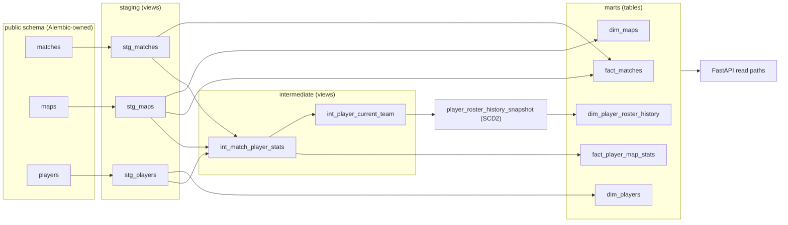

# Counter-Strike 2 Pro Match Analytics Tool

[](https://github.com/dardenkyle/CS2-analytics/actions/workflows/ci.yml)
[](https://github.com/dardenkyle/CS2-analytics/actions/workflows/ci.yml)
[](https://github.com/dardenkyle/CS2-analytics/actions/workflows/frontend-ci.yml)
[](https://github.com/dardenkyle/CS2-analytics/actions/workflows/deploy-frontend.yml)

**Live demo:** [dardenkyle.github.io/CS2-analytics](https://dardenkyle.github.io/CS2-analytics/) —
a public dashboard showing top players served live from the production
database. The API behind it is also public:
[cs2-analytics.onrender.com/docs](https://cs2-analytics.onrender.com/docs).
(The API runs on a free tier and can take up to ~30 seconds to wake after
idle periods.)

## Project Overview

This project is a Counter-Strike 2 analytics tool focused on collecting professional match, map, and player data and turning it into reliable, queryable analytics data.

The system is deployed end to end: a Python ingestion pipeline writes to
PostgreSQL, a dbt transformation layer builds tested fact and dimension
marts from the raw tables (rebuilt daily against the deployed database),
a FastAPI service on Render serves player statistics from those marts, and
a React SPA on GitHub Pages presents them publicly.

The current ingestion architecture uses PostgreSQL-backed ingestion-state tables, thin controllers for batch orchestration, and stage services for per-item match/map workflow boundaries.

## Features

### Data Ingestion

- Results discovery refreshes match ingestion-state rows.
- Match processing collects match metadata and discovers downstream map/demo links.
- Map processing collects player performance metrics such as kills, deaths, assists, ADR, KAST, opening duels, multi-kills, clutches, and round swing.
- Ingestion hardening uses retry/backoff, browser session recovery, and lifecycle tracking for resilient scraping runs.

### Analytics Transformation (dbt)

- Staging, intermediate, and mart layers over the ingestion schema, with
  data tests on every layer (see
  [Transformation Layer (dbt)](#transformation-layer-dbt)).
- SCD2 `player_roster_history_snapshot` records player-to-team roster
  history from observed changes.
- The marts serve the API's read paths, rebuild daily against the deployed
  database behind a source-freshness gate, and build in CI on every push.

### Deferred / Later-Phase Work

- Demo processing: deferred; the demo subsystem lives on the
  `feature/demo-parsing` branch, while demo link discovery and
  `demo_ingestion_state` tracking remain on `main`.
- Airflow orchestration: Airflow comes after dbt operational depth; the
  scheduled daily dbt build is the interim orchestration it would replace.

## Tech Stack

- Python 3.12
- SeleniumBase and BeautifulSoup for web scraping
- PostgreSQL for structured data storage, with Alembic-managed migrations
- dbt for the analytics transformation layer (staging / intermediate /
  marts, SCD2 snapshot, data tests; CI-verified and rebuilt daily in
  production)
- FastAPI for the public read API (deployed on Render)
- React, TypeScript, and Vite for the public frontend (deployed on GitHub
  Pages)
- Docker and Docker Compose for the container runtime
- GitHub Actions for CI (backend and frontend gates) and deployment
- uv with a committed lockfile for reproducible Python installs

## Project Structure

```text
CS2-Analytics/
|-- main.py
|-- run_api.py
|-- README.md
|-- pyproject.toml
|-- api/
|   |-- main.py
|   |-- routes/
|   |-- schemas/
|   `-- services/
|-- cs2_analytics/
|   |-- config/
|   |-- controllers/
|   |-- ingestion_state/
|   |-- models/
|   |-- parsers/
|   |-- pipeline/
|   |-- scrapers/
|   |-- stage_services/
|   |-- storage/
|   `-- utils/
|-- dbt/
|   |-- dbt_project.yml
|   |-- profiles.yml
|   `-- models/
|-- docs/
|-- logs/
|-- scripts/
|-- tests/
`-- frontend/
```

## Installation & Setup

### 1. Clone the Repository

```sh
git clone https://github.com/dardenkyle/CS2-analytics.git
cd CS2-Analytics
```

### 2. Install uv

If you do not have uv installed, pick one of:

```sh
# via pip
pip install uv

# via the official installer (macOS/Linux)
curl -LsSf https://astral.sh/uv/install.sh | sh

# via the official installer (Windows)
powershell -ExecutionPolicy ByPass -c "irm https://astral.sh/uv/install.ps1 | iex"
```

### 3. Install Dependencies

```sh
uv sync
```

This creates a `.venv` virtual environment and installs all runtime and
development dependencies from the committed `uv.lock` lockfile. Dev and
test tooling lives in `[dependency-groups]`, which `uv sync` installs by
default.

Activate the virtual environment before running subsequent `python`
commands:

```sh
source .venv/bin/activate  # On Windows: .venv\Scripts\activate
```

### 4. Configure Environment Variables

Copy `.env.example` to `.env` for local development and adjust the values for
your PostgreSQL instance.

Required runtime variables:

| Variable | Purpose | Local example |
| --- | --- | --- |
| `ENVIRONMENT` | Runtime environment name. Use `production` for deployed runtime validation. | `development` |
| `DEBUG_MODE` | Enables debug logging and API reload behavior. Must be `false` in production. | `true` |
| `API_HOST` | Host address used by `python run_api.py`. | `127.0.0.1` |
| `API_PORT` | Port used by `python run_api.py`. | `8000` |
| `API_CORS_ORIGINS` | Comma-separated browser origins allowed by the API. Wildcard CORS is rejected in production. | `http://localhost:8501` |
| `DB_NAME` | PostgreSQL database name. | `cs2_db` |
| `DB_USER` | PostgreSQL user. | `postgres` |
| `DB_PASS` | PostgreSQL password. | `change_me` |
| `DB_HOST` | PostgreSQL host. | `localhost` |
| `DB_PORT` | PostgreSQL port. | `5432` |

Optional variables:

| Variable | Purpose | Default |
| --- | --- | --- |
| `SOURCE_URL` | Overrides the results discovery URL used by the results scraper. | Built-in results source |

Production mode fails fast when required runtime variables are missing, when
`DEBUG_MODE=true`, or when `API_CORS_ORIGINS` includes `*`.

### 5. Set Up Database

Ensure PostgreSQL is installed and configure database credentials through your
local environment or `.env`.

Run the non-destructive migration path:

```sh
python manage_db.py --init
```

Running `python manage_db.py` with no flags also applies migrations. Deployed
environments should run the equivalent Alembic command during release startup:

```sh
alembic -c cs2_analytics/alembic.ini upgrade head
```

Day-to-day migration operations are also exposed through the CLI. Each
command first prints the target database (name, host, and port) so it is
obvious whether the environment points at a local or production database:

```sh
cs2a db current                  # show the database's current revision
cs2a db upgrade                  # apply migrations up to head; confirms first
cs2a db downgrade <revision>     # revert to a revision; confirms first
```

These wrap the same `alembic -c cs2_analytics/alembic.ini ...` commands with
the same environment-driven connection settings.

For an existing database that was already initialized from the current
`schema.sql`, first confirm the live schema matches the initial Alembic
migration, then mark it as migration-managed without recreating tables:

```sh
alembic -c cs2_analytics/alembic.ini stamp head
```

For first-time local setup when the configured PostgreSQL database does not
exist yet, create it and then apply migrations:

```sh
python manage_db.py --create-database
```

To explicitly wipe application tables:

```sh
python manage_db.py --wipe
```

The wipe command asks for `y` confirmation before dropping tables. Alembic owns
the application/source schema; the dbt models are downstream and do not
manage ingestion tables.

### 6. Run With Docker Compose

The Phase 3.75 deployment baseline includes a local container runtime for
PostgreSQL, migrations, the API, and pipeline runs.

Build the application image and start PostgreSQL plus the API:

```sh
docker compose up --build app
```

Apply database migrations in the compose environment:

```sh
docker compose --profile tools run --rm migrate
```

Run the ingestion pipeline in the compose environment:

```sh
docker compose --profile tools run --rm pipeline
```

The API is available at `http://localhost:8000` by default. See
`docs/deployment.md` for Docker build, environment variable, runtime data, and
container command details.

The `/api/top_players` endpoint reads the dbt-built marts
(`analytics.fact_player_map_stats`, `analytics.dim_players`), not the raw
ingestion tables, so on a fresh database run `dbt build` (section 10) after
migrations before exercising the API read path; the deployment smoke path
below is the exception and provisions its own minimal stand-ins.

Run the deterministic deployment smoke path after PostgreSQL, migrations, and
the API are available:

```sh
docker compose up -d db
docker compose --profile tools run --rm migrate
docker compose up -d app
docker compose --profile tools run --rm smoke
```

The smoke path seeds a tiny fixed-ID dataset, checks `/health`, verifies the API
can query PostgreSQL through the top players read path, and removes the smoke
rows before exiting. Because the API reads the dbt-built `analytics` marts and
the smoke database never runs dbt, the smoke script creates minimal mart
stand-ins (schema and the columns the read path uses) and seeds them directly. It should run against a local or deployment-validation
database, not a production analytics database, and does not depend on live
website scraping.

### 7. Run the Pipeline

```sh
python main.py
```

Or use the `cs2a` CLI installed with the package for individual stages:

```sh
cs2a ingest discover            # scrape results pages, queue new matches
cs2a ingest discover --mode backfill
cs2a ingest coverage            # discovery date coverage of the target window
cs2a process --batch 50         # process pending matches, then maps
cs2a status                     # ingestion-state row counts by status
cs2a failures --stage match     # recent failed rows with error details
cs2a failures --stage map --group   # aggregate failures by error message
cs2a inspect match 2394877      # one match: state row + relational presence
cs2a inspect map 230075         # one map: state row + player-stats count
cs2a retry --stage match        # requeue failed matches for reprocessing
cs2a retry --stage map --dry-run
cs2a retry --stage map --status processing --dry-run   # inspect rows stuck by an interrupted run
```

`cs2a failures` is read-only diagnostics for deciding whether to requeue:
it lists recent `failed` rows (or `dead`/`partial` via `--status`) with
`failure_count`, `last_failed_at`, and a truncated `last_error_message`,
ordered most recently failed first (`--limit`, default 20). `--group`
aggregates rows by error message so dominant failure modes - transient
scraper noise versus a structural break like a page layout change - are
obvious before running `cs2a retry`.

`cs2a ingest coverage` reports discovery date coverage: the configured
window (`START_DATE` through today), earliest/latest ingested match
dates, how many periods (`--period week` default, or `day`) contain
matches, contiguous zero-match gap ranges, and the
discovered-but-unprocessed backlog so "not discovered" is
distinguishable from "not yet processed". Backfill cursor state joins
the report once the backfill strategy (#121) lands.

`cs2a inspect` is the single-item companion: given one ID it prints the
full ingestion-state row (status, lifecycle timestamps, failure fields,
source, priority) plus whether the relational data actually landed - for
a match, whether the `matches` row exists, how many `maps` rows
reference it, and each map's ingestion status; for a map, whether the
`maps` row exists and its player-stats row count. Unknown IDs exit
nonzero. Both commands are read-only against whichever database the
environment points at.

`cs2a retry` resets `failed` ingestion-state rows back to `discovered` so
the next `cs2a process` run picks them up. `dead`, `partial`, and
`processing` rows are only requeued when named explicitly via `--status`,
including when targeting a single row with `--id`. `--status processing`
releases rows an interrupted run left behind (controllers also release
them automatically at startup); the command warns that releasing them
while a run is active can cause duplicate processing, so confirm no run
is in flight first. `--limit` bounds how much work is
requeued and `--dry-run` previews the affected rows without writing.
Before writing, the command shows the affected row count and the target
database and asks for confirmation. Requeueing preserves `failure_count`
and `last_error_message` as history; the requeue itself is visible via
`last_updated_at`.

### 8. Run the API

```sh
python run_api.py
```

Then open the host and port configured by `API_HOST` and `API_PORT`, such as
`http://127.0.0.1:8000/docs`.

### 9. Run Tests

```sh
python -m pytest
```

The DB-backed storage integration tests (`tests/storage/test_database.py`)
write and delete real rows, so they are skipped unless you opt in with
`CS2_ALLOW_DB_TESTS=true` *and* `DB_HOST` is a local database
(`localhost`, `127.0.0.1`, or the compose `db` service); they never run
against a remote database. CI opts in against its disposable service
container. To run them locally, point `DB_*` at the compose database:

```sh
docker compose --env-file .env.example up -d db
env CS2_ALLOW_DB_TESTS=true DB_HOST=127.0.0.1 DB_USER=postgres \
  DB_PASS=change_me DB_NAME=cs2_db python -m pytest tests/storage/test_database.py
```

### 10. Run dbt (analytics transformations)

dbt is installed with the dev dependencies (`uv sync`). Its default target is a
**local** Postgres, so `dbt run` never touches a deployed database by accident.
dbt uses its own `DBT_DB_*` variables (with local defaults, see `.env.example`)
and does not read `.env` itself. Start a local Postgres, load the schema,
install dbt packages, then build (models plus data tests):

```sh
docker compose --env-file .env.example up -d db
env DB_HOST=localhost DB_USER=postgres DB_PASS=change_me DB_NAME=cs2_db \
  uv run alembic -c cs2_analytics/alembic.ini upgrade head
uv run dbt deps --project-dir dbt --profiles-dir dbt
uv run dbt debug --project-dir dbt --profiles-dir dbt
uv run dbt build --project-dir dbt --profiles-dir dbt
```

`dbt build` runs the models, snapshots, and their data tests together; use
`dbt run`, `dbt snapshot`, or `dbt test` for any part on its own. The
`player_roster_history_snapshot` snapshot records SCD2 player-to-team roster
history: each run compares every player's current team against the recorded
history and effective-dates any changes, so history accrues across runs
(and resets with the local database). On a fresh database, run `dbt build`
(or `dbt snapshot`) before a standalone `dbt run`: `dbt run` does not
execute snapshots, and `dim_player_roster_history` reads the snapshot
table.

To browse the model/column documentation and the lineage graph, generate and
serve the dbt docs site locally (after a `dbt run` or `dbt build` so the
catalog reflects the built tables):

```sh
uv run dbt docs generate --project-dir dbt --profiles-dir dbt
uv run dbt docs serve --project-dir dbt --profiles-dir dbt
```

The generated site lives in `dbt/target/`, which is gitignored. The docs
are also published: the Pages deploy workflow regenerates the static site
whenever dbt models change on `main` and serves it at
<https://dardenkyle.github.io/CS2-analytics/dbt-docs/>.

To run against a deployed database on purpose, export its `DB_*` values and
name the `prod` target explicitly:

```sh
set -a; source .env; set +a
uv run dbt run --project-dir dbt --profiles-dir dbt --target prod
```

The dbt layer is CI-verified: the `dbt-build` job in
`.github/workflows/ci.yml` runs `dbt build` (models, snapshots, and data
tests) on every push and pull request against a disposable Postgres
service container, migrated with Alembic and seeded with a small
checked-in fixture (`scripts/seed_dbt_ci_fixture.py`) that writes through
the real storage layer. Any model or data-test failure fails CI.

The deployed database is also rebuilt automatically: the Scheduled dbt
Build workflow (`.github/workflows/scheduled-dbt-build.yml`) runs
`dbt build --target prod` daily (10:00 UTC, plus manual dispatch) so the
SCD2 roster snapshot observes changes as they happen - missed runs are
roster history that cannot be backfilled. Each run is gated by
`dbt source freshness`, so stale ingestion data fails the workflow
instead of silently freezing snapshot history. `fact_player_map_stats`
is an incremental model, so routine runs only reprocess recently updated
source rows; dispatch the workflow manually with the `full_refresh` input
set to true to rebuild it from scratch after model logic changes,
backfills, or bulk source corrections (see the full-refresh policy in
`docs/dbt_models.md`).

dbt owns analytics transformations only; the ingestion schema stays owned by
Alembic migrations. Sources are declared for the `matches`, `maps`, and
`players` tables. The staging layer (`stg_matches`, `stg_maps`, `stg_players`)
is thin views over those sources. See `docs/dbt_models.md` for the
model layers.

Note: Demo processing is still deferred and intentionally remains outside the active ingestion pipeline; its implementation lives on the `feature/demo-parsing` branch.

## Architecture Notes

Current stage boundaries:

- Controllers coordinate batches, retry policy, scraper reset/rotation, and summaries.
- Stage services own per-item fetch, parse, persist, and lifecycle outcome work.
- Scrapers fetch remote content only.
- Parsers convert fetched content into structured outputs only.
- Storage modules centralize relational writes.
- Ingestion-state tables track lifecycle for discovered matches, maps, and demos.

Current active flow:

```text
results discovery
-> match_ingestion_state refresh
-> MatchController batch
-> MatchStageService per-item workflow
-> map/demo ingestion-state refresh
-> MapController batch
-> MapStageService per-item workflow
-> relational storage
```

## Transformation Layer (dbt)

The analytics warehouse is a shipped dbt project (`dbt/`) layered over the
ingestion schema: staging views standardize the Alembic-owned source
tables, intermediate views factor the reusable joins, and mart tables are
the analytics-facing contract. The marts are not a side artifact - the
API's read paths query them in production, they are rebuilt daily against
the deployed database by a scheduled workflow, and the whole DAG builds
and tests in CI on every push.



Mart grains:

| Model | Grain | Notes |
| --- | --- | --- |
| `fact_player_map_stats` | one row per player per map (`map_id`, `player_id`) | per-map performance stats; serves the top players API read path |
| `fact_matches` | one row per match (`match_id`) | derives winning/losing team and map count |
| `dim_players` | one row per player (`player_id`) | player identity for joins |
| `dim_maps` | one row per map name (`map_name`) | map catalog across matches |
| `dim_player_roster_history` | one row per player-team membership interval (`player_id`, `valid_from`) | SCD2 shaped over the snapshot, with `is_current` flag |

The SCD2 piece is `player_roster_history_snapshot`: a dbt snapshot that
records player-to-team roster membership over time. The source data has no
reliable roster-change timestamps, so a `check`-strategy snapshot is the
right tool - each run compares every player's derived current team against
recorded history and effective-dates any change, so validity ranges come
from observed changes rather than trusting parsed dates. History accrues
run over run, which is why the scheduled daily build exists.

Every layer carries data tests (uniqueness of the declared grains,
not-null keys, relationship tests between models, and warn-severity
distribution checks on the mart stat columns - 76 in total), run by
`dbt build` locally, in CI against a disposable Postgres, and daily
against production behind a per-source freshness gate. Structural tests
fail the build; distribution tests warn until proven stable, and every
test stores its failing rows in an audit schema for triage (severity
policy in `docs/dbt_models.md`). The generated dbt docs
site - interactive lineage DAG and column-level documentation - is
published at <https://dardenkyle.github.io/CS2-analytics/dbt-docs/>.
Local run instructions are in
[section 10](#10-run-dbt-analytics-transformations); model-level
documentation lives in `docs/dbt_models.md`.

## Design Decisions & Tradeoffs

Short reasoning behind the choices that shaped the system. Full ADR-style
records live in `docs/architecture/decision_log.md`.

### Layered pipeline boundaries

Controllers, stage services, scrapers, parsers, and storage are separate
layers with one job each: controllers own batch coordination and retry
policy, stage services own a single item's fetch-parse-persist workflow,
scrapers only fetch, parsers only parse, and storage centralizes writes.
The tradeoff is more indirection than a small project strictly needs — but
each layer is testable without the others (parsers run against saved HTML,
no browser), scraping failures stay contained to the layer that talks to
the network, and later stages (dbt, new sources) attach without rewrites.
This split came from experience, not upfront design: controllers originally
absorbed per-item work until the mixed responsibilities made retry behavior
hard to reason about.

### Ingestion state over work queues

Discovered matches, maps, and demos live in PostgreSQL-backed
ingestion-state tables (`discovered`, `processing`, `processed`, `failed`,
`skipped`, `dead`, `partial`) rather than a disposable work queue. Rows are
keyed by source ID, so rediscovery refreshes existing rows instead of
duplicating work, and a rerun after a crash resumes from state instead of
starting over. The `skipped` versus `failed` distinction is deliberate:
`skipped` records an intentional decision not to process (for example a
forfeited match with no stats), while `failed` means a processing attempt
went wrong, and `dead` marks rows whose retries are exhausted so claim
queries can exclude them without counting failures. `partial` is reserved
for matches processed while some of their maps never reached a terminal
state. Collapsing these would make failure metrics lie. The tradeoff is
more lifecycle discipline than a queue requires — every outcome must be
recorded explicitly — in exchange for an ingestion run that is resumable,
idempotent, and observable.

### Stable grains and idempotent writes before analytics

The parsed source tables were locked to explicit grains before any
analytics work: `matches` is one row per match, `maps` one row per played
map, `players` one row per player per map. Storage writes are upserts that
refresh trusted fields, so re-running ingestion over the same matches never
duplicates rows. This was done ahead of the dbt layer because
transformation models are only as trustworthy as their sources — building
dbt on tables that could drift or duplicate would push data-quality
firefighting downstream where it is hardest to debug. The tradeoff is
slower feature delivery up front: schema and write-path discipline landed
before any user-visible analytics did.

### Simple, managed deployment first

The first cloud deployment uses deliberately simple, proven parts: Render
for the API and PostgreSQL, GitHub Pages for the frontend, and a manual
GitHub Actions workflow as the scraper runner — no Kubernetes, no Airflow, no
custom domain. Render builds the repository's own Dockerfile, so production
runs the same container image and the same entrypoints used locally through
Docker Compose (`python run_api.py` for the API, `python main.py` for the
pipeline) — one runtime to debug instead of a separate cloud configuration.
Production validation is read-only by policy: health checks and DB-backed
reads, with write-based smoke tests restricted to disposable databases. The tradeoff is fewer operational
capabilities (no ingestion scheduling, manual migrations) in exchange for a
deployment simple enough to reason about while the data layer was still
evolving; the scheduled daily dbt build was added once the transformation
layer stabilized.

### Demo parsing deferred behind a preserved boundary

Demo files introduce a different workload class: large binary downloads,
temporary-file lifecycle, long parses, and event-level extraction. Rather
than bolt that onto the match/map surface, demo processing is deferred
until downstream demo needs are concrete. The boundary is kept, not deleted: demo links are still
discovered during match processing and tracked in the demo
ingestion-state table, while the non-working downloader/parser
implementation lives on the `feature/demo-parsing` branch until
acquisition is unblocked. Demo expansion plugs back into the same
controller/stage-service pattern later. The tradeoff is no event-level
stats yet, in exchange for keeping the active pipeline small enough to
harden and deploy.

## Data Insights & Usage

Live today:

- Top players by average rating, served from the dbt marts and shown on
  the public demo page.
- Point-in-time roster queries over `dim_player_roster_history` (SCD2).

Planned:

- View per-match player performance.
- Compare teams' win rates on specific maps.
- Identify key players in matchups.
- Additional API read paths over the mart layer (matches, teams).

## Developer Notes

See `docs/` for architecture and roadmap details.

Current architecture direction:

- Phases 2 through 3.9 are complete, as is Phase 4 (the dbt transformation
  layer: staging / intermediate / marts, data tests, and the SCD2 roster
  snapshot).
- Frontend Phase A shipped the public GitHub Pages demo backed by the live
  API (see `docs/frontend_backlog.md`).
- Phase 4.5 (dbt operations and depth) is in progress: the scheduled daily
  prod build, CI dbt build, and mart-backed API read paths are shipped;
  incremental materializations and deeper data quality remain.
- Demo pipeline implementation remains deferred.
- Airflow comes after dbt operational depth and would replace the
  scheduled-build workflow.

## License

This project is licensed under the MIT License.

## Contact & Support

- GitHub Issues: [CS2-analytics Issues](https://github.com/dardenkyle/CS2-analytics/issues)
- Email: [dardenkyle@example.com](mailto:dardenkyle@example.com)
